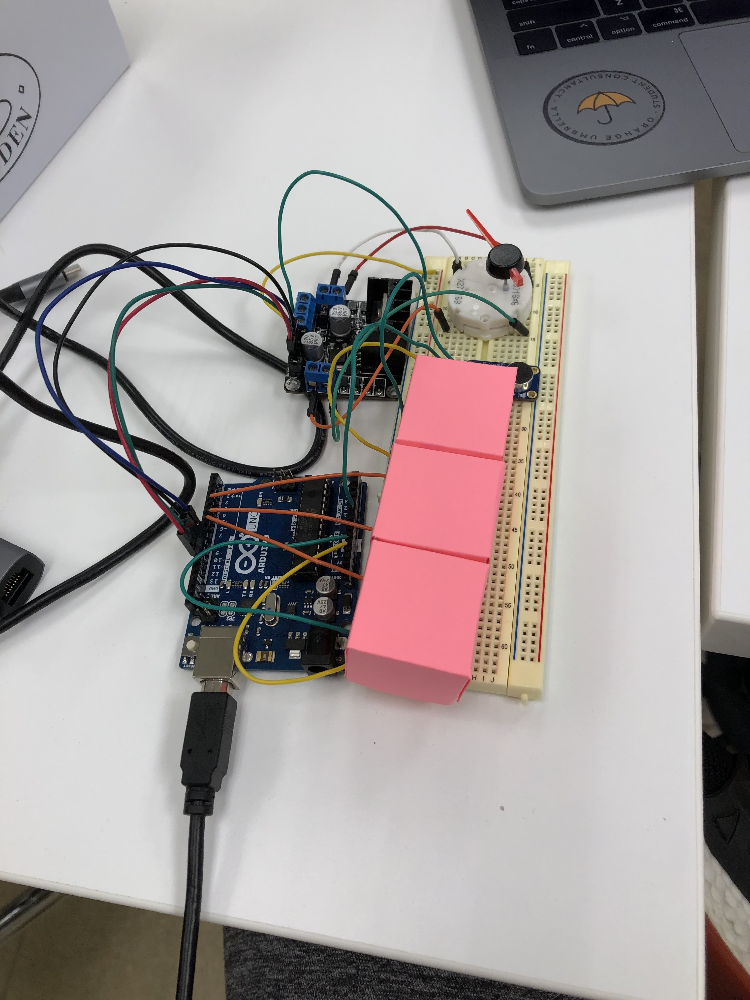

# CIM-542-Robots

<h1>The Party Meter by Josie Argento</h1>

 
My project is called the Party Meter. I really wanted to make something with lights that reacts to sound, because I have noticed that the combination of light and sound seems to captivate people (for example, lights in a club or at a concert, or even those little speakers that have lights that move to the music) The part meter has 3 sets of 3 LED's in green, red and yellow that light up depending on the volume level in the room. It also has a meter that indicates changes in volume. Ideally it would be a bit bigger, about the size of a standard toaster, and have a really fun design. The input for the party meter is sound: the volume level in the room. The user can interact with the input by talking, playing music, laughing, puttin on the TV, or prettymuch anything else that creates noise. I used a breadboard, LED's, a sound sensor, a stepper and motor, and lots of wires. I used those components becuase I needed all of them to achieve the final output, which is lights that turn on depending on how loud the noise in the room is and meter that goes up and down with the volume level. 
  
My program measures the volume in the room and then converts it into a number that can be interpreted by the other parts. Both the stepper and the LED then respond to those numbers. The Stepper moves one way when the number goes up, and the opposite way when the number goes down. The LED's are set to light up depending on a range of volume, so if the volume is relatively low, only the green lights turn on. If its medium, green and yellow lights turn on, and if its high, green, yellow and red lights turn on. 

The project worked properly but it was pretty hard to get it to react smoothly. For example, the room we were in for the interactive media fair was pretty loud, but the numbers were all over the place. I wish there was a way to find more of an average volume so that the meter interpreted sound more similarly to how a human would. To me, the sound in the room was constant, but to the sensor, there were huge changes in volume from millisecond to millisecond. If I had more time, I would have made the project bigger and prettier, with a better encasing and big, cool lights. Hopefully, I would have found a way to make it react more smoothly as well. 
  

<h2> Images </h2>

// 2 - Progress images
// 1 - Finished input
// 1 - Finished output
// 1 - Finished Breadboard

<h2>Video</h2>
<a href="https://youtu.be/k4vKIYBBacI">Watch here!</a>

<h2>The Code</h2>

  
#include <Stepper.h>

// change this to the number of steps on your motor
#define STEPS 600

// create an instance of the stepper class, specifying
// the number of steps of the motor and the pins it's
// attached to
Stepper stepper(STEPS, 8, 9, 10, 11);

const int analogInPin = A0;  // Analog input pin that the microfone is attached to
const int greenOutPin = 3; // Analog output pin that the green LED is attached to
const int yellowOutPin = 5; // Analog output pin that the yellow LED is attached to
const int redOutPin = 6; // Analog output pin that the red LED is attached to

int previous = 0;
int sensorValue = 0;        // value read from the pot
int outputValue = 0;        // value output to the PWM (analog out)

const int sampleWindow = 50; // Sample window width in mS (50 mS = 20Hz)
unsigned int sample;

void setup() {
  // set the speed of the motor to 30 RPMs
  stepper.setSpeed(30);
    Serial.begin(9600);
}

void loop() {
  // get the sensor value

   unsigned long startMillis= millis();  // Start of sample window
   unsigned int peakToPeak = 0;   // peak-to-peak level
 
   unsigned int signalMax = 0;
   unsigned int signalMin = 1024;
 
   // collect data for 50 mS
   while (millis() - startMillis < sampleWindow)
   {
      sample = analogRead(0);
      if (sample < 1024)  // toss out spurious readings
      {
         if (sample > signalMax)
         {
            signalMax = sample;  // save just the max levels
         }
         else if (sample < signalMin)
         {
            signalMin = sample;  // save just the min levels
         }
      }
   }
   
   peakToPeak = signalMax - signalMin;  // max - min = peak-peak amplitude
   int volts = ((peakToPeak * 5.0) / 1024) * 100;  // convert to volts
 
   Serial.println(volts);
// Mic read code ends

  // read the analog in value:
  //sensorValue = analogRead(analogInPin);

  // map it to the range of the analog out:
  outputValue =   map(volts, 0,244, 0,255);

  
  if (outputValue < 50) {
    analogWrite(greenOutPin, 255);
    analogWrite(yellowOutPin, 0);
    analogWrite(redOutPin, 0);

  } else if (outputValue > 180) {
    analogWrite(greenOutPin, 255);
    analogWrite(yellowOutPin, 255);
    analogWrite(redOutPin, 0);

    
  } else if (outputValue > 220) {
    analogWrite(greenOutPin, 255);
    analogWrite(yellowOutPin, 255);
    analogWrite(redOutPin, 255);

  }

  // print the results to the Serial Monitor:
  Serial.print("sensor = ");
  Serial.print(sensorValue);  
  Serial.print("\t output = ");
  Serial.println(outputValue);

  int stepperMove = map(volts, 0,244, 0,500);

// move a number of steps equal to the change in the sensor reading
 stepper.step(stepperMove - previous);
//
// remember the previous value of the sensor
  previous = stepperMove;
}

